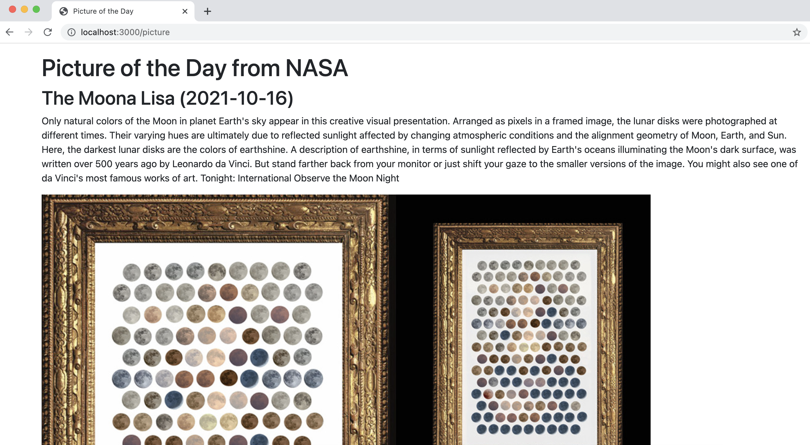
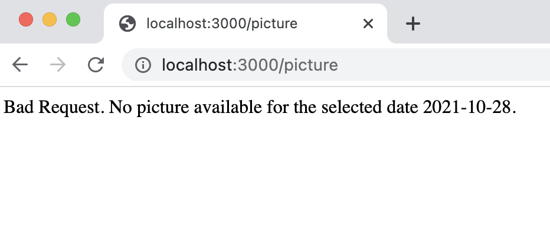

# Picture of the Day from NASA

Heroku: https://word-search-games.herokuapp.com

## Environment Setup

```
mkdir picture // create a project
cd picture
sudo npm install express-generator -g // tool that sets up a directory structure
cd ..
express picture // creates a directory structure in picture directory
cd picture
npm install
npm install hbs --save // handlebars
npm install
```

## Push to Heroku

- copy and paste picture/package.json to cs5610_audreyjo/package.json
- commit the change to git
- push the changes to heroku

```
heroku git:remote -a word-search-games -r a5 // add remote for heroku app
git push a5 master:main // push the changes to heroku
```

## Create Home Page

- created a form for submitting a date
- got express to render the home page
  - kept rendering the default jade file
  - tried to setup hbs in app.js, but got
    _Error: No default engine was specified and no extension was provided._
    - https://stackoverflow.com/a/23596000
    - went back to L5-files to correctly setup hbs in app.js

## Create Picture of the Day Page

- tested the picture of the day API using the browser
- the structure of the returned JSON was straightforward
- created an html file with {{JSON object key}} for all keys that I wanted to use
- copied the L6-files/requests/getRequestWithGet.js to my app.js to fetch data from the API
- tried to render picture.html file, but failed
  - `Error: Failed to lookup view "error" in views directory "cs5610_audreyjo/HW05/picture/views"`
  - resolved the error by adding `const https = require('https');`
- choosing a future date like October 28, 2021 creates an error
  - https://stackoverflow.com/a/7086621
  - caught the error and returned a message

## Website Screenshots

- home page
  
- use the date picker to choose a date (by default, today's date is highlighted)
  
- picture page
  
- error page returned when user chooses a future date
  
