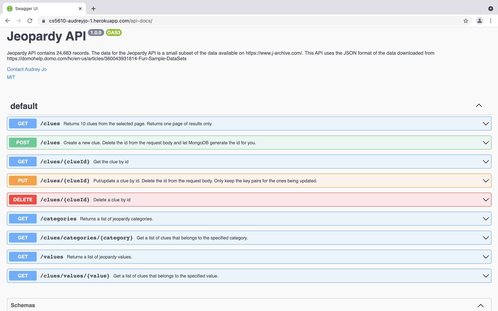

# Heroku Links for Assignments

- Assignment 4 (Breakout Game): https://breakout-game-5610.herokuapp.com
- Assignment 5 Picture of the Day (NASA): https://word-search-games.herokuapp.com
- Assignment 6 Jeopardy API: https://cs5610-audreyjo-1.herokuapp.com/api-docs

# Assignment 6 Summary

Directory: HW06/jeopardy

- each file has comments describing the errors encountered and code sources
- data/data.js adds JSON data to a MongoDB database called jeopardy in a collection called clues.
- follow tutorial for TodoListAPI to build bulk of jeopardy API https://www.codementor.io/@olatundegaruba/nodejs-restful-apis-in-10-minutes-q0sgsfhbd
- deploy database online and connect api to the db: https://www.freecodecamp.org/news/deploying-a-mern-application-using-mongodb-atlas-to-heroku/
- follow the tutorial for adding Swagger UI
  - https://blog.logrocket.com/documenting-your-express-api-with-swagger/
  - https://dev.to/kabartolo/how-to-document-an-express-api-with-swagger-ui-and-jsdoc-50do
  - https://github.com/satansdeer/swagger-api-library/blob/master/routes/books.js

API Documentation


# Daily Tasks

## Update local copy of a repository online with the latest version

1. Terminal: navigate to the local copy of the repo  
   `cd ~/Northeastern/github/cs5610/CS5610_ClassRepo`
2. Make a local copy of the repo  
   `git pull`

## Copy each Assignment from local copy of professor's repo to the local copy of my repo

1. Terminal: navigate to ~/Northeastern/github/cs5610 `cd ~/Northeastern/github/cs5610`
2. copy first assignment from professor's repo to mine (local repos) `cp -r CS5610_ClassRepo/L1-files cs5610_audreyjo`

## Commit and push changes to my repo

1. Check if any changes have been made since last commit `git status`
2. Add all changes to git staging directory `git add .`
3. Make a commit
   - with a short message `git commit -m "Initial commit"`
   - with a long message `git commit`
4. Create a tag
   - tag an old commit `git tag -a "assignment1" -m "Assignment 1" [commit_sha]`
   - tag the last commit `git tag -a "assignment1" -m "Assignment 1"`
5. View all commit messages `git log`
6. View all tags `git tag`
7. Push changes to remote repository (push tags as well) `git push --tags`

# One Time Setup

## Install VirtualBox on Mac

1. Go to https://www.virtualbox.org
2. Click _Download VirtualBox 6.1_
3. Click _OS X hosts_ for the download to start
4. Follow the instructions to install VirtualBox

## Download Ubuntu Server

1. Go to https://ubuntu.com
2. Click _Download_
3. Click _Get Ubuntu Server_
4. Click _Option 2 - Manual server installation_
5. Click _Download Ubuntu Server 20.04.3 LTS_

## Create an Ubuntu Server Virtual Machine on VirtualBox

1. Open VirtualBox
2. Click New and fill in the information
   Name _Ubuntu Server_
   Type _Linux_
   Version _Ubuntu (64-bit)_
3. Accept all defaults for the rest to create the VM
4. Click Settings for the Ubuntu Server
5. Display _200%_
6. Set Storage

- Click _Empty_ under _Controller: IDE_
- Click Choose a Disk File
- Click the downloaded ubuntu server .iso file

7. Disable Audio
8. Enable Network

- Attached to: Bridged Adapter
- Promiscuous Mode: Allow all

9. Close Settings
10. Start Ubuntu Server
11. Accept all defaults for set up

- if you get FAILED Cannot unmount CD rom, simply press Enter to continue

13. Restart Ubuntu Server when prompted
14. After reboot, do a Headless Start
15. Click Show, then run

```
sudo apt update
ifconfig -a
```

16. If it failed, then run

```
sudo apt install net-tools
if config -a
```

17. Copy the inet for enp0s3
18. Open the Terminal on Mac
19. SSH into Ubuntu Server on VirtualBox  
    `ssh username_ubuntu_server@enp0s3_inet_ubuntu_server`
20. If it failed, then open Ubuntu Server screen (Click Show), then run `sudo apt install openssh-server`
21. Switch to Terminal on Mac, then ssh into Ubuntu Server on VirtualBox again

## How to connect to Ubuntu Server on VirtualBox from Mac?

**Generate a new SSH key**

1. open Terminal on Mac
2. generate a new SSH key using your email  
   `ssh-keygen -t ed25519 -C "audreyjo35@gmail.com"`
3. prompts for "Enter file in which to save the key"  
   `.ssh/id_ed25519`
4. <kbd>return</kbd> to skip providing a passphrase
5. open config file for editing  
   `open ~/.ssh/config`
6. if the command fails, then try  
   `touch ~/.ssh/config`
7. edit the file as shown below, then save and close the file
   ```
   Host ubuntu
   HostName enp0s3_inet
   User ubuntu
   IdentityFile ~/.ssh/id_ed25519
   ```

**Add a new SSH key to Ubuntu Server on VirtualBox**

1. Copy the public keyfile to the home folder on the Ubuntu Server on VirtualBox
   `scp .ssh/id_rsa.pub username_for_ubuntu_server@enp0s3_inet_for_ubuntu_server:`
2. Log into Ubuntu Server
   `ssh username_for_ubuntu_server@enp0s3_inet_for_ubuntu_server`
3. Add the contents of the copied public key to the authorized keys file on the Khoury server
   `cat id_rsa.pub > .ssh/authorized_keys`
   - if following error occurs:`-bash: .ssh/authorized_keys: No such file or directory`
      - [solution](https://askubuntu.com/a/466558)
      - `mkdir ~/.ssh`
4. Exit the Ubuntu Server
   `exit`

**Test your SSH connection**

1. open Terminal on Mac
2. connect to Ubuntu Server on VirtualBox using SSH  
   `ssh ubuntu`
3. you may see a warning "Are you sure you want to continue connecting?"  
   `yes` + <kbd>return</kbd>

## How to open up specific ports on Ubuntu Server (VirtualBox)

Open up specific ports on the Ubuntu Server and lock the rest of the ports by using ufw (ubuntu firewall), which can only be run by super user.

```
sudo bash # start super user shell
ufw allow 22/tcp # allows ssh
ufw allow 80/tcp # allows normal HTTP
ufw allow 443/tcp # allows HTTPS
ufw allow 4000/tcp # allows the Phoenix dev server
ufw allow 5000/tcp # allows the dev server for Heroku
ufw allows 3000/tcp # allows local test/dev server
ufw enable # turns on the firewall and block all unmentioned ports
exit # exit super user shell
```

## How to install NodeJS on Ubuntu Server in VirtualBox

\*Source: (Installing NodeJS via package manager)[https://github.com/nodesource/distributions/blob/master/README.md#debinstall]

1. Start Ubuntu Server and ssh into it from Mac Terminal
2. Download Node JS installation files  
   `curl -fsSL https://deb.nodesource.com/setup_current.x | sudo -E bash -`
3. Install NodeJS  
   `sudo apt-get install -y nodejs`
4. Install Build-Essentials  
   `sudo apt-get install -y build-essential`
5. Install npm (install the latest version as suggested)
   `sudo npm install -g npm@7.23.0`
6. Uninstall express  
   `npm uninstall express`
7. Reinstall express version 4 to match the textbook
   `npm install express@4`

## Set Global Defaults for Git

**Set user and email to match the GitHub account used**  
Once the user name and email match the GitHub account used to commit, the commit author will match the GitHub account owner when posting the commits.  
If set for local, then it gets reset after a while. It's easier to update the global user and email every time you want to switch git accounts.

- `git config --global user.name "Audrey Jo"`
- `git config --global user.email "audreyjo@login-students.ccs.neu.edu"`

Set editor: `git config --global core.editor vim`

## How to connect to Khoury GitHub from Ubuntu Server on VirtualBox using a key?

**Generate a new SSH key**

1. open Terminal on Mac and log into Ubuntu Server on VirtualBox
2. generate a new SSH key using your Khoury GitHub email  
   `ssh-keygen -t ed25519 -C "audreyjo@login-students.ccs.neu.edu"`
3. prompts for "Enter file in which to save the key"  
   `.ssh/id_ed25519`
4. <kbd>return</kbd> to skip providing a passphrase
5. open config file for editing  
   `vi ~/.ssh/config`
6. if the command fails, then try  
   `touch ~/.ssh/config`
7. edit the file as shown below, then save and close the file
   ```
   Host neu
   HostName github.ccs.neu.edu
   User git
   IdentityFile ~/.ssh/id_ed25519
   ```

**Add a new SSH key to Khoury GitHub**

1. open Terminal on Mac and log into Ubuntu Server on VirtualBox
2. copy the SSH public key to your clipboard by running the command below, then cmd + C to copy  
   `vi ~/.ssh/id_ed25519.pub`
3. browser: log into Khoury GitHub
4. click the profile photo
5. click Settings
6. click SSH and GPG keys
7. click New SSH key
8. Fill in the Title and Key as shown below  
   Title: _Ubuntu Server_  
   Key: _paste the key copied from Terminal_
9. click Add SSH key
10. confirm your GitHub password

**Test your SSH connection**

1. open Terminal
2. connect to GitHub using SSH  
   `ssh neu`
3. you may see a warning "Are you sure you want to continue connecting?"  
   `yes` + <kbd>return</kbd>
4. if the following prompt is returned then SSH connection is working correctly
   Hi username! You've successfully authenticated, but GitHub does not provide shell access.

## Clone Professor's Repository on Khoury GitHub to Ubuntu Server on VirtualBox

1. Get the link for professor's repository

- Browser: navigate to the professor's repo
- Click Code
- Click SSH and copy the link

2. On Terminal, ssh into Ubuntu Server on VirtualBox
3. Navigate to the folder to save the cloned repo
   `cd ~`
4. Replace git@github.ccs.neu.edu: with git clone neu:  
   `git clone neu:sav/CS5610_ClassRepo.git`

## Clone My Repository on Khoury GitHub to Ubuntu Server on VirtualBox

1. Copy the link to my repo

- Browser: navigate to my repo
- Click Code
- Click SSH and copy the link

2. On Terminal, ssh into Ubuntu Server on VirtualBox
3. Navigate to the folder to save the cloned repo
   `cd ~`
4. Replace git@github.ccs.neu.edu: with git clone neu:  
   `git clone neu:audreyjo/cs5610_audreyjo.git`

## Getting Started on Heroku with Node.js on Ubuntu (VirtualBox)

Follow the instructions (here)[https://devcenter.heroku.com/articles/getting-started-with-nodejs]

**Troubleshooting Errors I encountered**

1. Install Heroku on Ubuntu Server in VirtualBox.  
   Use `-i` flag when logging into Heroku from the command line.  
   `heroku login -i`
2. Open http://localhost:5000 from browser on my Mac
   Run `ifconfig -a` on Ubuntu Server on VirtualBox.
   Find the inet for enp0s3
   The address should be http://enp0s3_inet:5000

## Assignment 3

**Bootstrap Grid Layout**

- Source: LinkedIn Learning Create a Quick, Clean, and Cheap Website with Bootstrap Templates
- Free Bootstrap templates: https://startbootstrap.com/?showPro=false
- Bootstrap layout: 12 column grid system
- Can have infinite number of rows
- Each element in the same row can occupy different number of columns but they must sum up to 12

_Responsive breakpoints_

- https://getbootstrap.com/docs/5.0/layout/breakpoints/
- Bootstrap already has device-specific breaking points, or lengths chosen based on pixel width of screen sizes, for how we can redistribute our website’s layout
- Breaking points are distributed in 5 categories:
  - xs: less than 576px, vertically held mobile phone
  - sm: 576px - 767px, horizontally held mobile phone
  - md: 768px-991px, tablet
  - lg: 992px-1199px, laptops and computers
  - xl: 1199px <, extra wide monitors, larger computer screens

_Main bootstrap class syntax_

- `col-[size]-[#columns]`
- `<div class=“col-lg-2 col-md-3 col-sm-6”>`
- size: one of 5 screen size designations
- #columns: number of columns the element should span at that screen size designation range
- May want to define one for each breaking point for a single element
- xl layout by default, inherits the same column span defined for lg
- When you specify a breaking point’s column span, by default, the layout is applied to all the screen sizes above or larger than the specified screen size
- xs: by default, takes up the full 12-column row or split the screen with any other element that also has an undefined xs size, if they are wrapped in an element with a row class
- No need to define xs when specifying the column span.
  - Use col rather than col-xs
  - col-12 is the default and doesn’t need to be specified
- If Bootstrap layouts are not displaying as you expect, try wrapping them in a div with class container tag. If that doesn’t do the trick, then add a second internal div, wrapping them with class row.
  - Ex. `<div class=“container”><div class=“row”><div class=“col-md-4…”>`

_Requirements_

- Portrait-view mobile devices (col-xs)
  - Each element takes up the entire screen width
- Landscape-view mobile devices (col-sm) and tablets (col-md)
  - Each element takes up half the screen width
- Laptop screens (col-lg)
  - Elements 1 and 4 each take up 1/4 of the screen width
  - Elements 2 and 3 each take up 3/4 of the screen width
  - Meaning 1 & 2 should be on the same row and 3 & 4 should be on the next row
- Larger monitors (col-xl)
  - All four elements fit evenly on the same row

_Code adhering to the requirements_

```
<div class=“container”>
  <div class=“row”>
    <div class=“col-sm-6 col-lg-3”></div>
    <div class=“col-sm-6 col-lg-9 col-xl-3”></div>
    <div class=“col-sm-6 col-lg-9 col-xl-3”></div>
    <div class=“col-sm-6 col-lg-3”></div>
  </div>
</div>
```

**Bootstrap Navigation**

- Source: LinkedIn Learning Bootstrap 5 Essential Training
  - [Interactive slides for the course](https://raybo.org/slides_bootstrap5) (contains live code examples)

_Navigation_  
[source slides](https://go.raybo.org/4AJD)

- The set of nav classes are meant for simpler navigations
- navbar classes are more complex in comparison
- can be used with:

  - ordered list
  - unordered list
  - divs
  - nav tag (with nav class is the recommended usage)

- nav classes are aligned with flex box classes

- types of nav
  - nav (contains nav-item)
  - nav-item (contains nav-link)
  - nav-link

[CodePen](https://codepen.io/planetoftheweb/pen/jOypKXZ?editors=1000): examples of using Navs with unordered lists, divs, nav tags

_Navigation Bar_  
[source slides](https://go.raybo.org/4AJG)

- for building main navigation items
- <nav class="navbar"></nav>
- has classes:
  - bg-{COL}: background color
    - COL: primary, secondary, success, danger, warning, info, light, dark, white
    - when using bg, you must specify navbar-light/dark
  - navbar-{COL}: background
    - COL: light, dark
  - navbar-expand-{BR}: expand the links to a horizontal section at specified breakpoints
  - container{-BR}: navbar usually has a container for aligning the text inside the navbar to the Bootstrap grid
    - BR: sm, md, lg, xl, xxl, fluid (breakpoints)
  - navbar-nav: this section is where all the links belong
    - series of list items with anchor tags
    - just anchor tags
    - nav-item: class for list items
    - nav-links: class for the anchor tags
    - if only using anchor tags, then both classes would be used for the anchor tags

[CodePen](https://codepen.io/planetoftheweb/pen/PoWBBye?editors=1000): examples of using Navbar

**Statically Positioning the Header and Footer**

- headers and footers should be statically positioned at the top and bottom respectively
- they should not scroll with the rest of the content
- [Bootstrap Placement](https://getbootstrap.com/docs/5.1/components/navbar/#placement)
- use `fixed-top` and `fixed-bottom` classes

**Adding space between Header/Footer and Body**

- [Bootstrap Spacing](https://getbootstrap.com/docs/5.1/utilities/spacing/)
- use class `mb-5` or `mt-5`: set margin top/bottom spacer \* 3
- consistent spacing between header/footer and body regardless of screen size, unlike setting margins in plain css

**Make different content display/hide at various breakpoints**

- [Display Content](https://getbootstrap.com/docs/4.0/utilities/display/)

**Run Node JS app**

- start Ubuntu Server on VirtualBox
- ssh into Ubuntu Server
- create package.json and edit server.js according to [Node JS app on Heroku](https://stackabuse.com/deploying-a-node-js-app-to-heroku/)
- place package.json and server.js at the root folder
- run `npm start`
- use a browser to navigate to http://enp0s3_inet_ubuntu_server:3000

**Deploy a NodeJS app on Heroku**

- [Node JS app on Heroku](https://stackabuse.com/deploying-a-node-js-app-to-heroku/)
- package.json must be at the root folder of the git repository in order for heroku to recognize what buildpack to run (Node JS)

```
heroku login -i
heroku create
git remote -v
git push heroku master:main
git remote rename heroku a3
```

## Assignment 4

**Deploy another NodeJS app on Heroku from same repo**

- place server.js at the root folder of the git repository for easy access
- update the folder used in server.js
  - `app.use(express.static('L4-files'));`
  - the folder should contain index.html
- no need to modify server.js
- create a new heroku app from the website
- add the heroku app as a remote branch in git
- start needs to be edited from `node ./bin/www` to `node ./HW05/wordsearch/bin/www`

  ```
  // add with repo name (a5 is branch name)
  heroku git:remote -a word-search-games -r a5

  // add with url
  git remote add a4 https://git.heroku.com/breakout-game-5610.git
  git remote -v
  ```

- deploy app on heroku `git push a4 master:main`

**Run the server and other commands simultaneously**

- stop the server `Ctrl + Z`
- run the server in the background `bg`
- this gives the prompt back to the user allowing user to run other commands and still have the server running
- display processes running `ps -ef`
- display process containing app.js `ps -ef | grep app.js`
- kill app.js process (1623 was the PID for app.js in this example) `kill -9 1623`
- if kill command returns an error: No such process
  - exit ssh connection to Ubuntu Server on VirtualBox
  - reconnect to Ubuntu Server
  - find the PID again
  - try to kill the process again

**Create a Node Project**

```
mkdir blog
cd blog
npm init // initialize a new node package
```

- accept all defaults for npm init prompt
- entry point: index.js
- package.json file created

**Install Express**

- need to install express using npm
- `npm install express --save`
- saves express as a dependency on the app being built
- upgrade npm if needed

**Edit app.js file to take advantage of Express**

- create new app.js inside blog directory for the blog service
